# The Blue Spine: Spatiotemporal Analysis of Urban Cooling Island Intensity in Tianjin

**Quantifying the Micro-climatic Regulation of the Haihe River via Remote Sensing and Geographically Weighted Regression (2020–2025)**


---

## Abstract

Urban Heat Islands (UHI) pose escalating public health and energy challenges in rapidly urbanizing megacities. While vast literature examines heat island formation through impervious surface expansion (Imhoff et al., 2010) and the cooling benefits of urban green infrastructure (Zhang et al., 2014), the spatially heterogeneous cooling mechanisms of urban rivers — particularly linear water bodies threading through dense built-up fabrics — remain under-characterized across seasons.

This project investigates the **Urban Cooling Island (UCI)** effect of the Haihe River in Tianjin, China. Leveraging Landsat 8/9 Collection 2 Level-2 imagery from 2020–2025, we construct **12 monthly climatological baselines** through five-year median compositing. We apply a multi-method analytical framework — **multi-ring buffer analysis**, **univariate and multivariate Geographically Weighted Regression (GWR)** (Wang et al., 2020), and **spatial autocorrelation diagnostics** (Moran's I, LISA, Getis-Ord Gi*) — to quantify the distance-decay pattern, seasonal dynamics, and land-cover drivers of the river's cooling effect within a 1,500 m riverside corridor across six central urban districts.

Our results reveal summer cooling of up to **2.63°C** within 300 m of the riverbank, a logarithmic distance-decay pattern with a **Threshold Value of Efficiency (TVoE)** extending to ~870 m in summer, and strong seasonal asymmetry — consistent with findings on large planar water bodies in the same region (Wang et al., 2023). A sinusoidal model explains **90.5%** of the seasonal variance in cooling intensity.

---

## Key Findings

### 1. Riverside Corridor Cooling (GWR: 0–1,500 m)

| Season | LST Near (0–300 m) | LST Far (750–1,500 m) | ΔT (°C) | GWR R² |
|:------:|:-------------------:|:---------------------:|:--------:|:------:|
| **Summer** (Jun–Aug) | 38.65 | 41.27 | **−2.63** | 0.659 |
| **Spring** (Mar–May) | 26.34 | 28.60 | −2.26 | 0.649 |
| **Autumn** (Sep–Nov) | 22.10 | 23.22 | −1.12 | 0.530 |
| **Winter** (Dec–Feb) | 5.63 | 6.32 | −0.69 | 0.577 |

The figure below shows the July (peak summer) cooling gradient. LST rises steeply within the first 300 m of the riverbank, following a logarithmic curve, then levels off toward the urban background temperature beyond ~750 m. Error bars represent the standard deviation of LST within each buffer ring. The fitted equation and R² are displayed directly on the chart.

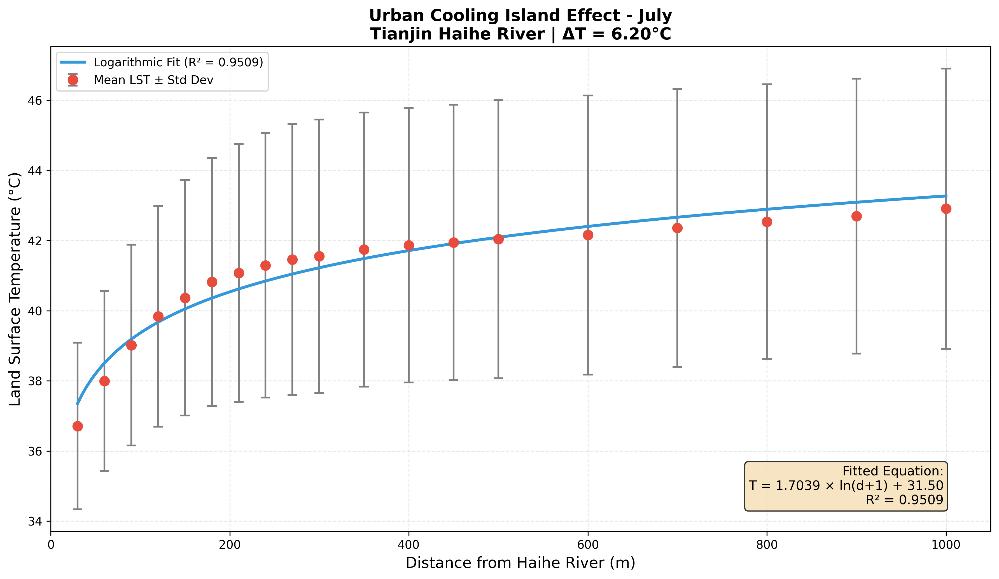

The bar chart below summarises cooling intensity (ΔT = LST_far − LST_near) across all 12 months, confirming that the river exerts a positive cooling effect year-round, with a clear summer peak and winter minimum.

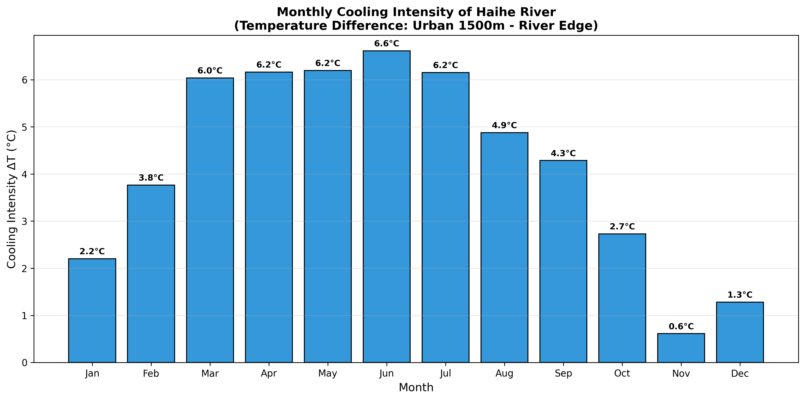

---

### 2. Seasonal Dynamics (Buffer Analysis: 0–1,500 m)

| Season | Mean ΔT (°C) | Mean TVoE (m) | Peak Month | R² Range |
|:------:|:------------:|:-------------:|:----------:|:--------:|
| **Summer** | 2.57 ± 0.32 | 867 ± 58 | July (2.90°C) | 0.45–0.61 |
| **Spring** | 2.19 ± 0.01 | 633 ± 208 | March (2.20°C) | 0.38 |
| **Autumn** | 1.07 ± 0.84 | 867 ± 58 | September (1.94°C) | 0.42–0.64 |
| **Winter** | 0.63 ± 0.36 | 450 ± 390 | February (1.04°C) | 0.16–0.34 |

**Sinusoidal fit:** ΔT(t) = 1.16 · sin(2πt/12 + φ) + 1.80, **R² = 0.905**

The sinusoidal model below captures the annual cycle of cooling intensity. Each dot represents an observed monthly ΔT; the red curve is the fitted model. The peak is marked with an arrow. The close agreement between the model and observations (R² = 0.905) indicates that the river's cooling mechanism is highly predictable at the seasonal scale.

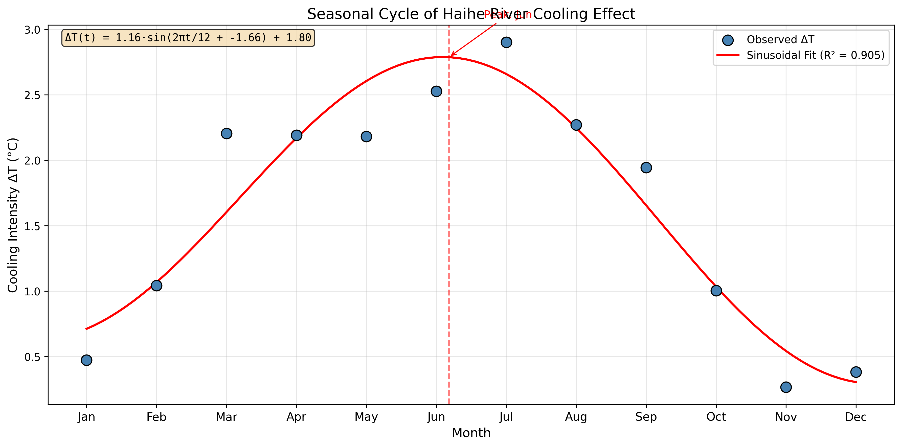

The two-panel figure below gives a complementary view: the upper panel compares absolute LST near and far from the river across all months, with the shaded area representing the cooling effect; the lower panel shows the derived monthly ΔT as a bar chart.

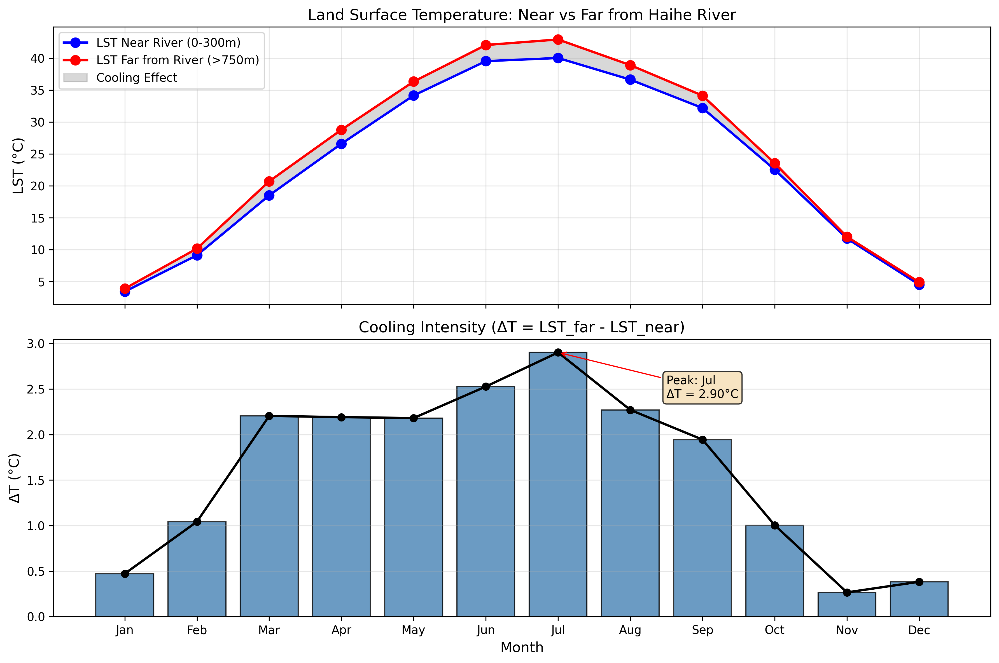

The overlay below places all 12 monthly LST gradient profiles on a single axis. The warm-to-cool colour gradient (red = summer, blue = winter) makes the seasonal separation immediately visible. Note how the profiles fan out near the river (left side) and converge toward the urban background at 1,500 m.

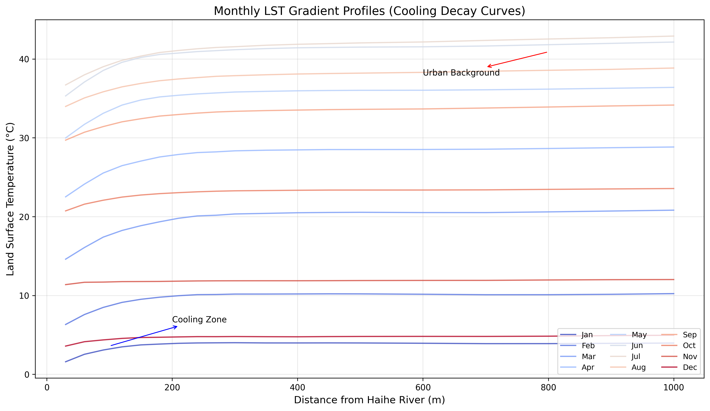

---

### 3. Multivariate GWR Coefficients (Summer, 0–300 m)

| Predictor | Mean Coefficient | Role |
|:---------:|:----------------:|:----:|
| Distance to River | +32.70 | Farther from river → higher LST |
| NDBI (Built-up) | +3.60 | Impervious surface amplifies warming |
| NDVI (Vegetation) | +1.55 | Spatially varying cooling co-benefit |

The four-panel figure below shows the spatial distribution of GWR coefficients for July. Top-left: LST map. Top-right: local coefficient for Distance (how strongly proximity to the river suppresses LST at each location). Bottom-left: NDVI coefficient. Bottom-right: local R². The spatial variation in coefficients confirms that the river's influence is not uniform — it is strongest in dense urban fabric directly adjacent to the water.


The grouped bar chart below compares the mean absolute coefficient of each predictor across all 12 months, revealing the relative importance of Distance, NDVI, and NDBI in explaining LST variance throughout the year.

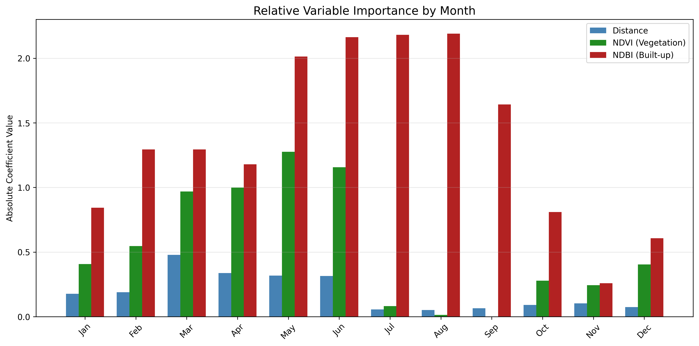

---

### 4. Principal Conclusions

1. **Summer cooling reaches 2.63°C** within 300 m (GWR corridor), cross-validated by buffer-based ΔT of 2.57°C.
2. The cooling effect follows a **logarithmic distance-decay** — strongest within 0–500 m, transitioning at 500–750 m. TVoE extends to **~870 m** in summer, shrinking to **~450 m** in winter.
3. **Built-up density (NDBI)** is the dominant warming driver near the river — aligning with Imhoff et al.'s (2010) regional-scale finding that impervious surface fraction explains up to 90% of LST variance.
4. **Summer cooling is ~3.8× stronger than winter** (2.63°C vs. 0.69°C), paralleling the seasonal asymmetry documented for Meijiang Lake in Tianjin (Wang et al., 2023). A sinusoidal model captures **90.5%** of this variance.
5. The multivariate GWR achieves **R² = 0.53–0.66** in the corridor; buffer-based regression R² ranges from 0.16 (winter) to 0.64 (autumn).

---

## Methodology

### Data Acquisition & Preprocessing

| Item | Specification |
|:-----|:-------------|
| **Satellite** | Landsat 8/9 Collection 2 Level-2 (Surface Reflectance + Thermal) |
| **Period** | 2020-01-01 – 2025-12-31 |
| **Compositing** | Monthly median, aggregated across 5 years → 12 baselines |
| **Resolution** | 30 m |
| **CRS** | EPSG:32650 (WGS 84 / UTM Zone 50N) |
| **Cloud Masking** | QA_PIXEL bit-mask (cloud, shadow, cirrus) |
| **Platform** | Google Earth Engine (JavaScript API) |

### Remote Sensing Indices

| Index | Formula | Application |
|:-----:|:-------:|:-----------:|
| **LST** | Single-channel algorithm (TIRS Band 10) | Land surface temperature |
| **NDWI** | (Green − NIR) / (Green + NIR) | Water body delineation |
| **NDVI** | (NIR − Red) / (NIR + Red) | Vegetation density |
| **NDBI** | (SWIR₁ − NIR) / (SWIR₁ + NIR) | Built-up intensity |

### Analytical Framework

```
Script 00  ──▶  GEE data export (monthly median composites)
Script 01  ──▶  Band extraction, reprojection, water masking (NDWI > 0)
Script 02  ──▶  Multi-ring buffer analysis (30–1,500 m), zonal statistics, distance-decay fitting
Script 03  ──▶  Univariate GWR: LST ~ f(Distance), Gaussian kernel (BW = 500 m)
Script 04  ──▶  Spatial autocorrelation: Global Moran's I, LISA clusters, Getis-Ord Gi*
Script 05  ──▶  Seasonal aggregation, sinusoidal model fitting ΔT(t) = A·sin(ωt + φ) + C
Script 06  ──▶  Multivariate GWR: LST ~ Distance + NDVI + NDBI (requires 4-band v2 data)
Script 07  ──▶  Riverside corridor analysis (0–1,500 m), distance-band GWR, seasonal summary
```

### Distance Bands & Buffer Strategy

- **Buffer distances:** 30, 60, 90, 120, 150, 200, 300, 500, 750, 1000, 1500 m
- **GWR corridor bands:** 0–100, 100–200, 200–300, 300–500, 500–750, 750–1000, 1000–1500 m
- **Kernel:** Gaussian, fixed bandwidth = 500 m
- **Sample spacing:** 200 m (univariate), 100 m (multivariate)

---

## Visual Outputs

### Univariate GWR (Script 03)

The side-by-side map below is produced for each month. The left panel shows the raw LST distribution across the study area; the right panel shows the spatially varying local regression slope (how strongly distance predicts LST at each location). Warmer colours on the right indicate locations where the distance-to-river relationship is most pronounced.

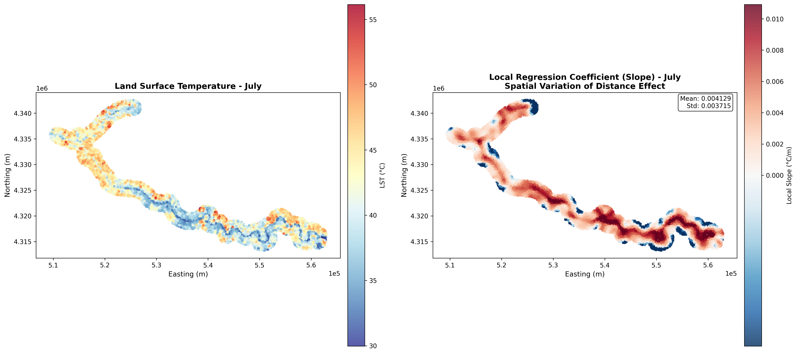

The summary chart below aggregates univariate GWR results across all 12 months. Left: monthly slope coefficient (°C per km), which is consistently positive, confirming that LST always increases with distance from the river. Right: monthly R², which peaks in summer when the thermal contrast is largest.

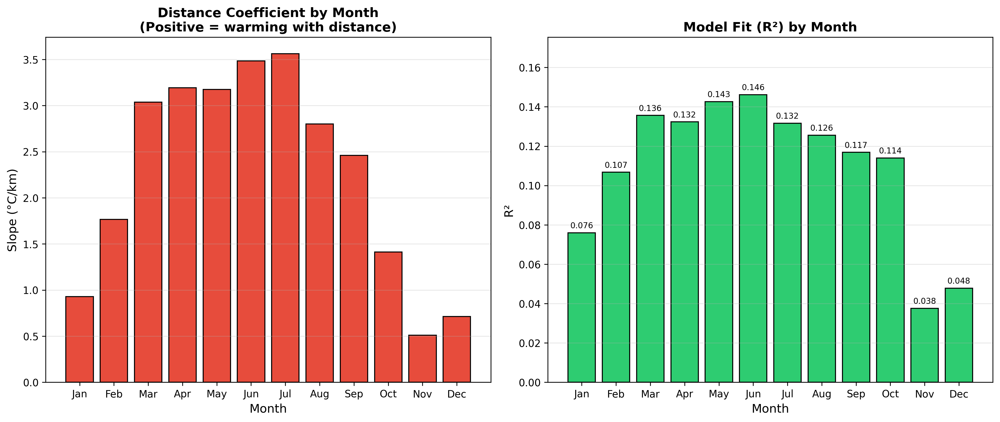

---

### Spatial Autocorrelation (Script 04)

The LISA cluster map below (July) identifies statistically significant spatial clusters in LST. Red (High-High) clusters mark urban heat islands; blue (Low-Low) clusters mark the cold corridor along the river. Outlier pixels at cluster boundaries are shown in orange and light blue. Only significant clusters (p < 0.05, 999 permutations) are coloured.

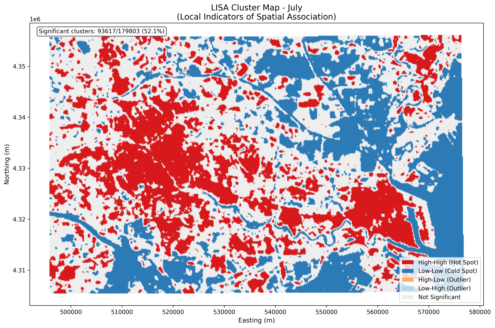

The Getis-Ord Gi* map complements the LISA analysis by measuring the intensity of clustering rather than the cluster type. Locations with Gi* z-scores above ±2.58 (99% confidence) are confirmed hot or cold spots. The cold spot corridor following the Haihe River is consistently detected across all seasons.

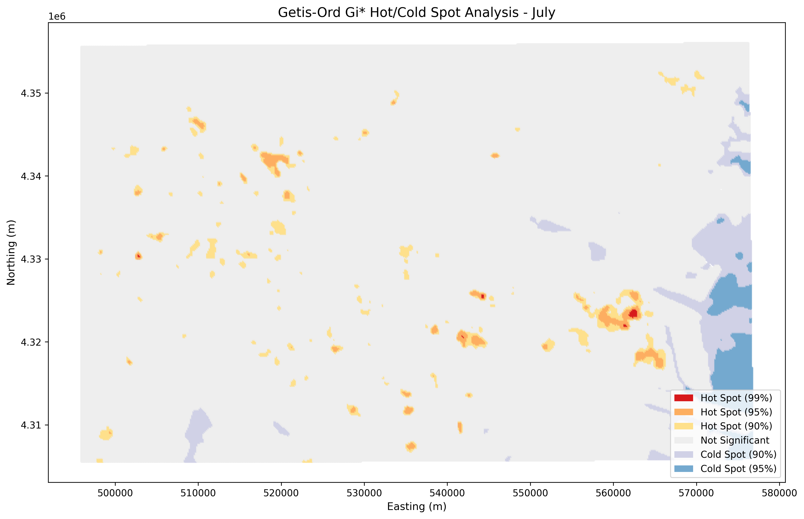

The summary chart below tracks Global Moran's I and the count of significant hot/cold spots across all 12 months. All months show highly significant positive spatial autocorrelation (I > 0, p < 0.001), with hot-spot counts peaking in summer.

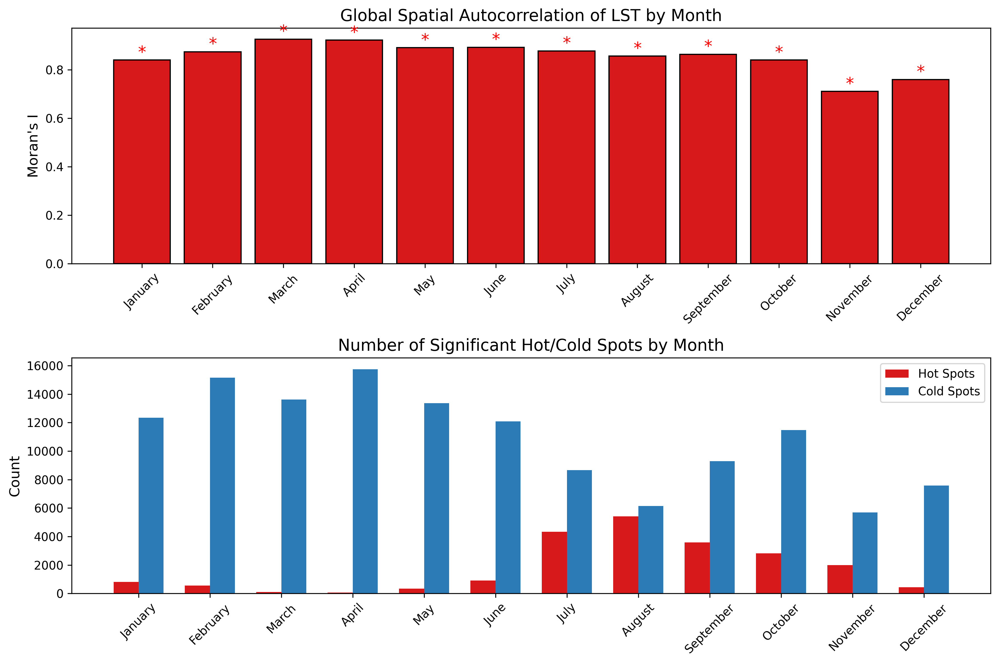

---

### Riverside Corridor Analysis (Script 07)

The two-panel figure below synthesises the full riverside corridor. Left: LST cooling gradient by season — summer shows the steepest decay from the riverbank outward. Right: model R² by distance band, showing that GWR explains more variance in zones immediately adjacent to the river (where the cooling signal dominates) than in outer bands where urban morphology is more complex.

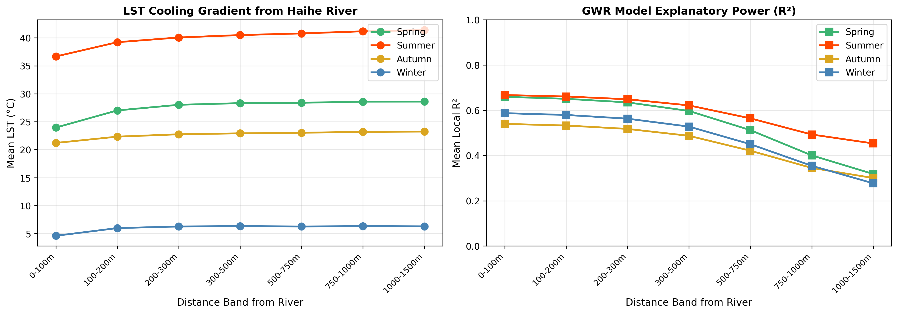

The stacked bar chart below shows the relative contribution of each predictor (Distance, NDVI, NDBI) to explaining LST variance within each distance band during summer. Distance dominates in the innermost band (0–100 m), while NDBI becomes the primary driver beyond 300 m as the direct river effect weakens and impervious surface heterogeneity takes over.

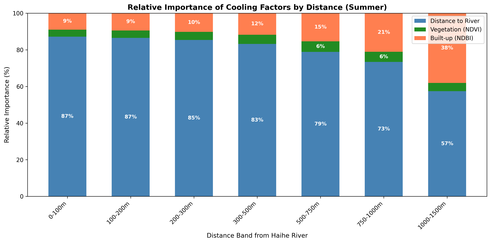

The seasonal comparison below overlays all four seasons for each coefficient profile. The Distance coefficient is consistently largest in summer, reflecting the amplified thermal contrast between the river and surrounding urban fabric when solar loading is highest.

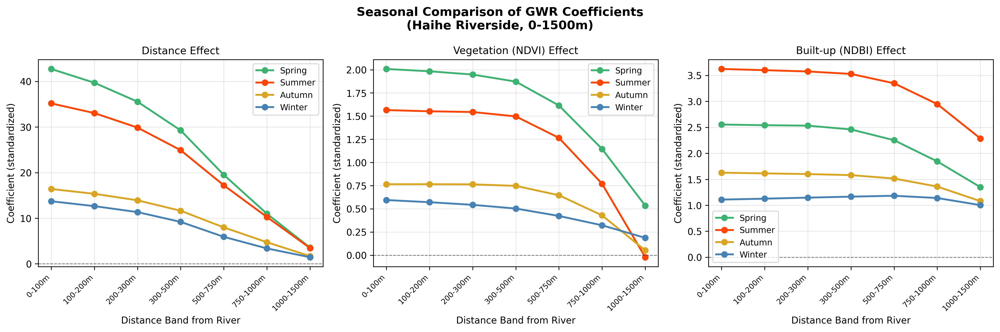

---

## Study Area

**Tianjin, China** — 6 Central Urban Districts: Heping, Nankai, Hexi, Hedong, Hebei, Hongqiao

| Parameter | Value |
|:---------:|:-----:|
| Bounding Box (WGS 84) | 116.9528°–117.8853°E, 38.8987°–39.3504°N |
| Climate | Warm-temperate semi-humid continental monsoon |
| River | Haihe River (the "Blue Spine" of Tianjin) |
| Urban morphology | High-density mixed residential/commercial |

---

## Repository Structure

```
Tianjin_Haihe_Cooling/
│
├── Scripts/
│   ├── config.py                      # Centralised paths, constants, season definitions
│   ├── 00 GEE_data_acquisition.js     # Google Earth Engine export (JavaScript)
│   ├── 01 preprocessing.py            # Band extraction & NDWI water masking
│   ├── 02 LST retrieval.py            # Buffer analysis, zonal stats, curve fitting
│   ├── 03 GWR analysis.py             # Single-variable GWR (LST ~ Distance)
│   ├── 04 spatial_autocorrelation.py  # Moran's I, LISA, Getis-Ord Gi*
│   ├── 05 seasonal_analysis.py        # Seasonal aggregation & sinusoidal modelling
│   ├── 06 multivariate_GWR.py         # LST ~ Distance + NDVI + NDBI
│   └── 07 riverside_analysis.py       # Corridor analysis (0–1,500 m)
│
├── Data/
│   ├── Raw_TIF/                       # GEE exports (v1: 2-band; v2: 4-band)
│   ├── Processed/Month_XX/            # Single-band extracted TIFs per month
│   ├── Vector/                        # Haihe_River.shp, buffer shapefiles
│   ├── GWR_Results/                   # Univariate GWR sample CSVs (×12 months)
│   ├── GWR_Multivariate/              # Multivariate GWR outputs + summary
│   ├── Spatial_Stats/                 # Autocorrelation results + summary
│   └── Seasonal_Metrics_Summary.csv   # Seasonal buffer analysis metrics
│
├── Maps/
│   ├── Buffer_Analysis/               # Cooling gradient & decay curves
│   ├── GWR_SingleVar/                 # Local coefficient maps
│   ├── GWR_Multivariate/              # Coefficient distribution maps
│   ├── Spatial_Autocorrelation/       # LISA cluster & hot/cold spot maps
│   ├── Seasonal_Analysis/             # Temporal pattern charts
│   └── Riverside_Analysis/            # Corridor summary & band-level outputs
│
├── Docs/
│   └── OPERATION_GUIDE.md             # Step-by-step execution guide (all 8 phases)
│
├── requirements.txt
├── LICENSE
└── README.md
```

---

## Getting Started

### Prerequisites

- Python ≥ 3.9
- Google Earth Engine account (for Script 00)
- Raw TIF data exported from GEE placed in `Data/Raw_TIF/`

### Installation

```bash
git clone https://github.com/<username>/Tianjin_Haihe_Cooling.git
cd Tianjin_Haihe_Cooling
pip install -r requirements.txt
```

### Execution

Scripts are numbered sequentially. Run them in order:

```bash
# After completing GEE export (Script 00) manually:
python "Scripts/01 preprocessing.py"
python "Scripts/02 LST retrieval.py"
python "Scripts/03 GWR analysis.py"
python "Scripts/04 spatial_autocorrelation.py"
python "Scripts/05 seasonal_analysis.py"
python "Scripts/06 multivariate_GWR.py"    # requires v2 4-band data
python "Scripts/07 riverside_analysis.py"
```

All paths are managed through `Scripts/config.py`. See `Docs/OPERATION_GUIDE.md` for detailed instructions.

---

## Dependencies

| Package | Purpose |
|:--------|:--------|
| `numpy`, `pandas` | Numerical computing & data manipulation |
| `rasterio` | Geospatial raster I/O |
| `geopandas`, `shapely` | Vector data handling & geometry operations |
| `scipy` | Curve fitting, optimisation, statistical tests |
| `matplotlib` | Visualisation |
| `libpysal`, `esda`, `splot` | Spatial weights, autocorrelation (Moran's I, LISA, Gi*) |
| `openpyxl` | Excel export support |

---

## References

1. Imhoff, M. L., Zhang, P., Wolfe, R. E., & Bounoua, L. (2010). Remote sensing of the urban heat island effect across biomes in the continental USA. *Remote Sensing of Environment*, 114(3), 504–513. https://doi.org/10.1016/j.rse.2009.10.008

2. Wang, Z., Fan, C., Zhao, Q., & Myint, S. W. (2020). A geographically weighted regression approach to understanding urbanization impacts on urban warming and cooling: A case study of Las Vegas. *Remote Sensing*, 12(2), 222. https://doi.org/10.3390/rs12020222

3. Wang, L., Wang, G., Chen, T., & Liu, J. (2023). The regulating effect of urban large planar water bodies on residential heat islands: A case study of Meijiang Lake in Tianjin. *Land*, 12(12), 2126. https://doi.org/10.3390/land12122126

4. Zhang, B., Xie, G., Gao, J., & Yang, Y. (2014). The cooling effect of urban green spaces as a contribution to energy-saving and emission-reduction: A case study in Beijing, China. *Building and Environment*, 76, 37–43. https://doi.org/10.1016/j.buildenv.2014.03.003

---

## Author

**Congyuan Zheng (Othello)**
University of Colorado Boulder
Department of Geography & Applied Mathematics
GEOG 4503: GIS Project Management

---

## License

This project is licensed under the MIT License — see [LICENSE](LICENSE) for details.
